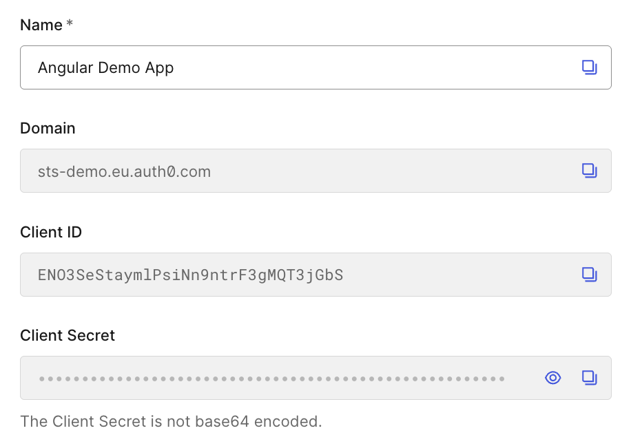
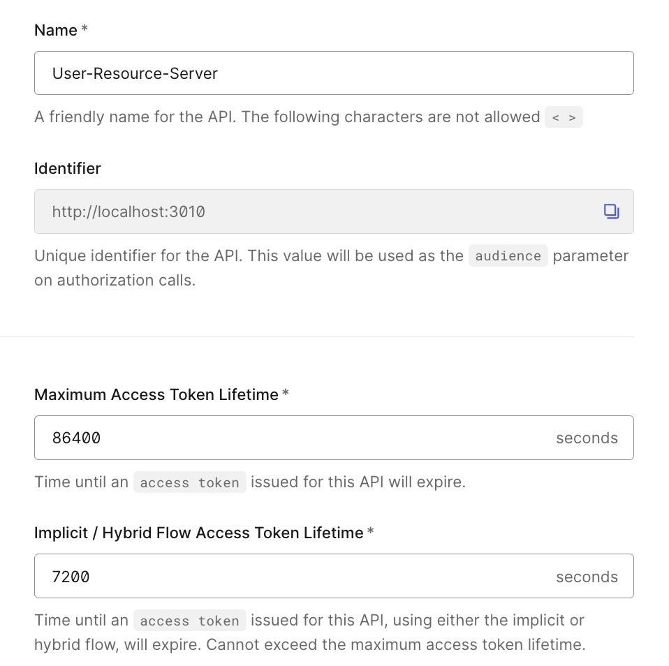
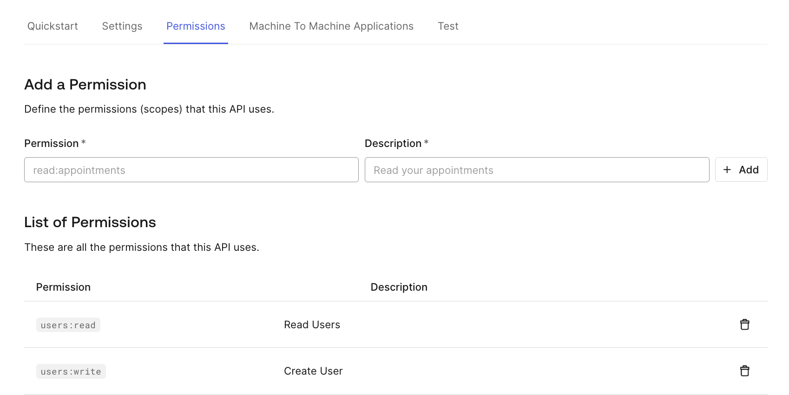
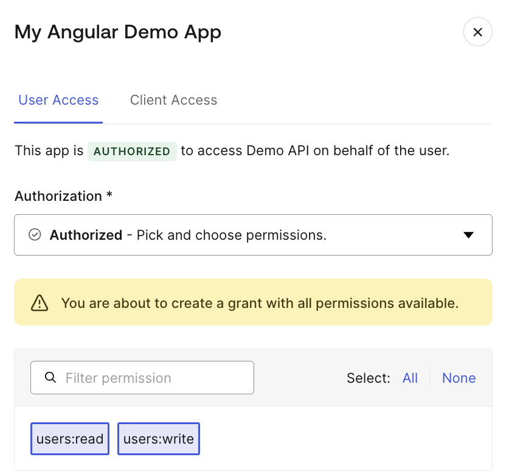

# Auth0 Setup

Die Konfiguration von Auth0 umfasst mehrere Schritte, die sowohl die Angular-Anwendung als auch die .NET Core API als eigenständige Entitäten im OAuth-Ökosystem registrieren. Auth0 unterscheidet dabei zwischen **Applications** (Clients) und **APIs** (Resource Servern).

> **Wichtig:** Für die folgenden Schritte wird ein Auth0-Account benötigt, der unter [auth0.com](https://auth0.com) kostenlos erstellt werden kann. Für kleinere Entwicklungs- und Testzwecke reicht der kostenlose Free-Tier vollständig aus.

Für eine vollständige Übersicht aller Optionen empfiehlt sich die [offizielle Auth0-Dokumentation](https://auth0.com/docs).

---

## 1. Tenant und Domain

Jede Auth0-Instanz ist einem Tenant zugeordnet, der über eine eindeutige Domain erreichbar ist. Diese Domain dient als Basis-URL für alle Auth0-Endpoints: Authorization Endpoint, Token Endpoint und JWKS Endpoint sind unter dieser Domain verfügbar. Die Domain wird sowohl in der Angular-Konfiguration als auch in der .NET Core API-Konfiguration referenziert.

---

## 2. Application registrieren (Public Client)

1. Gehe zum [Auth0 Dashboard](https://manage.auth0.com) → **Applications → Applications**
2. Klicke auf **Create Application**
3. Wähle **Single Page Application** als Application Type
4. Notiere dir:
   - **Domain** (z.B. `dev-example.eu.auth0.com`)
   - **Client ID**


*Abbildung 1.1: Applikation registrieren (Public Client)*

> **Hinweis:** Der Application-Typ „Single Page Application" signalisiert Auth0, dass es sich um einen Public Client handelt, der kein Client Secret sicher verwahren kann. Auth0 generiert dennoch eines – dieses sollte jedoch nicht verwendet werden.

### Application URIs konfigurieren

Setze folgende Werte unter **Application URIs**:

| Feld | Wert |
|------|------|
| Allowed Callback URLs | `http://localhost:4000` |
| Allowed Logout URLs | `http://localhost:4000` |
| Allowed Web Origins | `http://localhost:4000` |

- **Callback URLs** definieren, zu welchen URLs Auth0 nach erfolgreicher Authentifizierung zurückleiten darf (Redirect URIs in der OAuth-Spezifikation).
- **Logout URLs** definieren, wohin Auth0 nach einem Logout weiterleiten darf.
- **Web Origins** sind relevant für CORS: Auth0 akzeptiert nur Anfragen von den hier konfigurierten Origins.

> **Sicherheitshinweis:** In Produktionsumgebungen müssen hier die tatsächlichen Domain-URLs der Anwendung eingetragen werden. Die strikte Validierung der Callback URLs ist ein zentraler Sicherheitsmechanismus von OAuth 2.0 und verhindert Authorization Code Injection-Angriffe.

---

## 3. API registrieren (Resource Server)

1. Gehe zu **Applications → APIs**
2. Klicke auf **Create API**
3. Konfiguriere:
   - **Name:** beliebig (z.B. `Demo API`)
   - **Identifier (Audience):** `http://localhost:3010`
   - **Signing Algorithm:** RS256

Der API Identifier erscheint im `aud`-Claim des ausgestellten Access Tokens. Die API validiert bei jeder Anfrage, ob der `aud`-Claim mit ihrer eigenen Audience übereinstimmt.

Die Token-Lebensdauer kann ebenfalls hier konfiguriert werden. Der Standardwert beträgt `86400` Sekunden (24 Stunden).


*Abbildung 1.2: API registrieren (Resource Server)*

Zum Abschluß den `Create`-Button klicken.

### Permissions (Scopes) definieren

Gehe nun innerhalb deinen API-Settings zu dem Reiter **Permissions**.
Füge folgende Scopes hinzu:

| Scope | Beschreibung |
|-------|--------------|
| `users:read` | Berechtigung zum Abrufen von Nutzerdaten |
| `users:write` | Berechtigung zum Erstellen und Modifizieren von Nutzerdaten |


*Abbildung 1.3: Permissions (Scopes) definieren)*

### Application Access autorisieren

Damit eine registrierte Application überhaupt Tokens für diese API anfordern darf, muss der Zugriff explizit erlaubt werden. Standardmäßig ist jede Application für jede API mit **UNAUTHORIZED** markiert.

Wechsle innerhalb der API-Settings auf den Reiter **Application Access**. Dort siehst du alle registrierten Applications deines Tenants. Suche deine Angular-Application und klicke auf **Edit**.

Wähle dort den Reiter **User Access**
Im Dropdown stehen drei Optionen zur Verfügung:

| Option | Bedeutung |
|--------|-----------|
| **Unauthorized** | Kein Zugriff – Application erhält keine Tokens für diese API |
| **Authorized** | Zugriff erlaubt – du wählst explizit, welche Scopes die Application verwenden darf |
| **All** | Zugriff auf alle aktuellen **und zukünftigen** Scopes der API |

Wähle **Authorized** und selektiere anschließend die gewünschten Scopes (`users:read`, `users:write`). Damit wird im ausgestellten Token nur die Teilmenge der Scopes enthalten, die hier explizit erlaubt wurde – unabhängig davon, was der Client im Authorization Request anfordert.


*Abbildung 1.4: App Zugriff auf eine API konfigurieren)*

> **Empfehlung:** Vermeide die Option **All** in Produktionsumgebungen. Neu hinzugefügte Scopes würden automatisch für diese Application freigegeben, ohne dass eine bewusste Entscheidung getroffen wurde. **Authorized** mit explizit gewählten Scopes folgt dem Principle of Least Privilege.

> **Hintergrund:** Auth0 setzt diesen Mechanismus als zusätzliche Sicherheitsebene ein. Selbst wenn eine Application die korrekten Scopes anfordert, wird Auth0 den Token verweigern, solange der Zugriff auf die API nicht explizit autorisiert wurde. Dadurch lässt sich granular steuern, welche Clients auf welche Resource Server zugreifen dürfen.

---

## 4. Nutzer anlegen

Für Entwicklungs- und Testzwecke werden Test-Nutzer über das Auth0 Dashboard angelegt:

1. Gehe zu **User Management → Users**
2. Klicke auf **Create User**
3. Gib E-Mail und Passwort ein

Alternativ kann die Nutzerregistrierung aktiviert werden, sodass neue Nutzer sich selbst registrieren können. Die Konfiguration der Authentifizierungsmethoden erfolgt unter **Authentication → Database**. Dort kann festgelegt werden:
- ob Nutzer sich selbst registrieren dürfen
- welche Passwort-Richtlinien gelten
- ob Multi-Faktor-Authentifizierung erzwungen wird

Unterstützte Authentifizierungsmethoden: Username/Password, Social Logins (Google, Microsoft, GitHub), Enterprise-Verbindungen (SAML, LDAP) oder Passwordless (Magic Link, SMS).

---

## 5. Konfiguration in die Anwendung übertragen

### Frontend (`public-client/src/app/auth/auth.config.ts`)

```typescript
export const authConfig: AuthConfig = {
  domain: 'DEINE-AUTH0-DOMAIN.auth0.com',
  clientId: 'DEINE-CLIENT-ID',
  authorizationParams: {
    redirect_uri: window.location.origin,
    audience: 'http://localhost:3010',
    scope: 'openid profile email users:read users:write',
  },
  useRefreshTokens: true,
  httpInterceptor: {
    allowedList: ['http://localhost:3000/api/*'],
  },
};
```

### Backend (`api/appsettings.json`)

```json
{
  "Auth0": {
    "Domain": "DEINE-AUTH0-DOMAIN.auth0.com",
    "Audience": "http://localhost:3010"
  }
}
```
